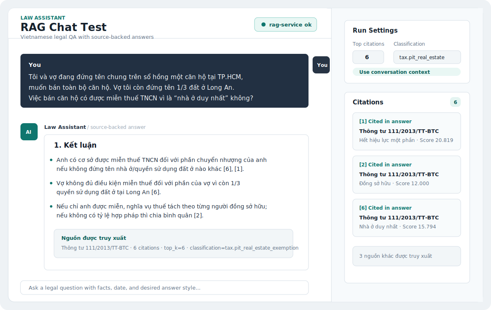
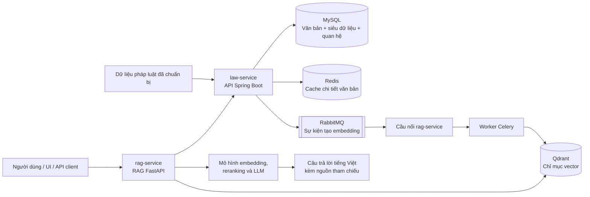
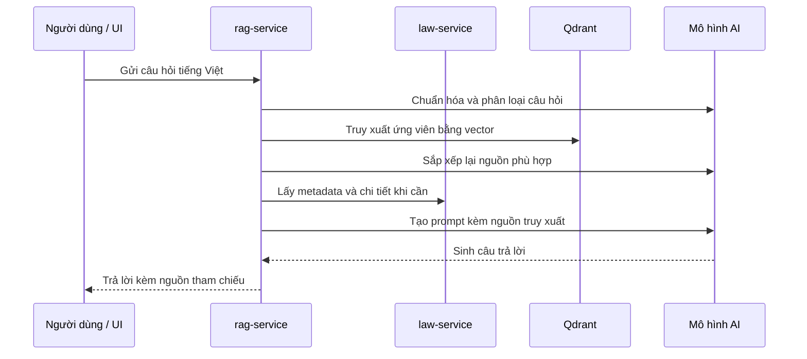

# Law Assistant

Law Assistant là nền tảng trợ lý pháp luật Việt Nam chạy local-first. Dự án kết hợp API quản lý văn bản pháp luật có cấu trúc với dịch vụ RAG (Retrieval-Augmented Generation) để người dùng có thể tìm kiếm văn bản, truy xuất đoạn căn cứ liên quan và tạo câu trả lời tiếng Việt có nguồn tham chiếu.

Repository này hiện là prototype kỹ thuật đang chạy được, chưa phải sản phẩm hosted production. Mục tiêu hiện tại là chứng minh các lợi thế cốt lõi của một trợ lý pháp luật AI: câu trả lời có căn cứ, truy xuất theo miền pháp luật, lọc theo metadata văn bản, và tách rõ lớp dữ liệu pháp luật khỏi lớp sinh câu trả lời bằng AI.

> Dự án phục vụ nghiên cứu pháp luật và phát triển sản phẩm. Nội dung sinh ra không thay thế tư vấn pháp lý từ chuyên gia.

## Demo Hội Thoại

Preview dưới đây mô phỏng cách hội thoại được hiển thị trong UI test local: câu hỏi pháp lý bằng tiếng Việt, câu trả lời có cấu trúc, và panel nguồn truy xuất để kiểm tra căn cứ.

[](docs/rag-demo-conversations.md)

Xem bản case study đầy đủ tại [Demo hội thoại RAG](docs/rag-demo-conversations.md).

## Tổng Quan



## Vì Sao Dự Án Này Cần Thiết

Nghiên cứu pháp luật Việt Nam khó vì câu trả lời đúng thường phụ thuộc vào hiệu lực văn bản, ngày ban hành, ngày có hiệu lực, cơ quan ban hành, quan hệ thay thế/sửa đổi, và ngữ cảnh cấp điều/khoản/điểm. Một chatbot tổng quát có thể viết trôi chảy, nhưng không tự đảm bảo văn bản nào được truy xuất, văn bản đó còn hiệu lực hay không, hoặc đoạn nào thật sự hỗ trợ kết luận.

Law Assistant được xây quanh các ràng buộc đó:

- **Câu trả lời có căn cứ**: phản hồi RAG trả về danh sách nguồn được truy xuất.
- **Hiểu metadata pháp luật**: hỗ trợ lọc theo loại văn bản, trạng thái hiệu lực, phạm vi, cơ quan ban hành, mã văn bản ngoài, và khoảng ngày.
- **Ưu tiên tiếng Việt pháp luật**: cấu hình embedding model và ngôn ngữ trả lời mặc định cho văn bản pháp luật Việt Nam.
- **Tách trách nhiệm rõ ràng**: `law-service` quản lý dữ liệu pháp luật chuẩn; `rag-service` xử lý indexing, retrieval, reranking và answer generation.
- **Dễ chạy local**: MySQL, Redis, RabbitMQ và Qdrant chạy bằng Docker Compose.

## Những Gì Đã Triển Khai

### Legal Document Service

`law-service` là API Spring Boot để import, lưu trữ, tìm kiếm và phục vụ văn bản pháp luật.

Đã có:

- Import dữ liệu Parquet đã chuẩn bị vào MySQL.
- Lưu metadata, nội dung đầy đủ và quan hệ giữa văn bản.
- Tìm kiếm văn bản có phân trang và bộ lọc.
- Trả về chi tiết văn bản theo ID.
- Cache chi tiết văn bản bằng Redis.
- Publish RabbitMQ embedding-update event cho một văn bản hoặc toàn bộ corpus.
- Quản lý thay đổi schema bằng Flyway migration.
- Health check qua Spring Boot Actuator.

Endpoint chính:

```text
GET  /actuator/health
POST /api/imports/provided-data
GET  /api/documents
GET  /api/documents/ids
GET  /api/documents/{id}
POST /api/documents/{id}/embedding-events
POST /api/documents/embedding-events
```

### RAG Service

`rag-service` là dịch vụ FastAPI để truy xuất đoạn căn cứ pháp luật và tạo câu trả lời có nguồn.

Đã có:

- Nhận document update event qua RabbitMQ bridge.
- Đưa job indexing vào queue bằng Celery và Redis.
- Chunk văn bản pháp luật cho truy xuất.
- Embed text bằng Vietnamese legal embedding model.
- Lưu vector trong Qdrant.
- Rerank ứng viên truy xuất bằng CrossEncoder.
- Phân loại một số nhóm câu hỏi pháp luật tiếng Việt để cải thiện retrieval.
- Sinh câu trả lời qua LLM provider có thể cấu hình, mặc định dùng stub cho local development.
- Trả về câu trả lời, truy vấn đã chuẩn hóa, phân loại câu hỏi, truy vấn retrieval và nguồn tham chiếu.
- Có lệnh audit độ phủ indexing và evaluation runner.
- Có document picker UI nhẹ tại `/documents`.
- Có hook quan sát bằng Langfuse/OpenTelemetry.

Endpoint chính:

```text
GET  /health
GET  /documents
GET  /api/documents
GET  /api/documents/{document_id}
POST /api/rag/ask
```

### Test UI

`UI_test` là giao diện browser nhỏ để test thủ công.

Đã có:

- Hỏi đáp qua RAG API.
- Xem trang chi tiết văn bản.
- Test health API và cấu hình OpenAI-compatible.
- Lưu conversation state local phục vụ manual QA.

## Quy Mô Dữ Liệu Hiện Tại

Dữ liệu local đang nằm trong `data_usable/`.

Thống kê hiện tại đọc trực tiếp từ các file Parquet:

| Nhóm dữ liệu | File | Số dòng |
| --- | --- | ---: |
| Siêu dữ liệu văn bản | `data_usable/current_new/metadata.parquet` | `147965` |
| Ngữ cảnh đầy đủ | `data_usable/current_new/context.parquet` | `5220792` |
| Nội dung cấp văn bản trong ngữ cảnh | `context_type = DOCUMENT` | `147965` |
| Quan hệ văn bản | `data_usable/current_new/relationships.parquet` | `758489` |
| Mốc neo điều/khoản/điểm | `data_usable/current_new/anchors.parquet` | `5072827` |
| Tài liệu sẵn sàng cho RAG | `data_usable/rag/law_documents.parquet` | `127267` |
| Chunk sẵn sàng cho RAG | `data_usable/rag/law_chunks.parquet` | `1203686` |
| Quan hệ sẵn sàng cho RAG | `data_usable/rag/law_relationships.parquet` | `651966` |

File chính trong `data_usable/`:

- `data_usable/current_new/metadata.parquet`
- `data_usable/current_new/context.parquet`
- `data_usable/current_new/relationships.parquet`
- `data_usable/current_new/anchors.parquet`
- `data_usable/rag/law_documents.parquet`
- `data_usable/rag/law_chunks.parquet`
- `data_usable/rag/law_relationships.parquet`
- `data_usable/audit/data_quality_report.json`
- `data_usable/audit/bad_documents.csv`

`law-service` importer nhận được cả `content.parquet` hoặc `context.parquet` làm nguồn nội dung văn bản. Dataset hiện tại ở root dùng `context.parquet`.

Kết quả import kỳ vọng cho bộ `current_new` hiện tại:

- `metadataRows`: `147965`
- `contentRows`: `147965`
- `relationshipRows`: `758489`

Nếu commit file Parquet lớn lên GitHub, nên dùng Git LFS.

## Luồng Xử Lý RAG



## Cấu Trúc Repository

```text
LawAssistant/
├── law-service/      # Spring Boot legal document API va importer
├── rag-service/      # FastAPI retrieval, indexing, reranking va answer API
├── UI_test/          # Browser UI tuy chon cho manual testing
├── data_usable/      # Bang du lieu local da chuan bi
├── dataset/          # Workspace dataset va ghi chu creation
└── scripts/          # Helper xu ly du lieu
```

## Công Nghệ Sử Dụng

| Lớp | Triển khai hiện tại |
| --- | --- |
| Legal document API | Java 19, Spring Boot 3.5, Spring Data JPA |
| Relational storage | MySQL |
| Schema migration | Flyway |
| Cache | Redis |
| Eventing | RabbitMQ |
| RAG API | Python 3.11+, FastAPI, Pydantic |
| Async indexing | Celery, Redis, RabbitMQ bridge |
| Vector store | Qdrant |
| Embeddings | `mainguyen9/vietlegal-harrier-0.6b` |
| Reranking | `cross-encoder/ms-marco-MiniLM-L-6-v2` |
| LLM integration | OpenAI-compatible/chat-completions style client có thể cấu hình, local stub mặc định |
| Observability | Langfuse và OpenTelemetry hooks |

## Chạy Nhanh

### Yêu Cầu

- Java 19+
- Maven
- Python 3.11+
- Docker và Docker Compose

### 1. Chạy dịch vụ phụ thuộc cho Law Service

```bash
cd /home/lee/Documents/LawAssistant/law-service
docker compose up -d
```

Đợi MySQL sẵn sàng:

```bash
until docker compose exec mysql mysqladmin ping -h localhost -ulaw -plaw --silent; do
  echo "waiting for mysql..."
  sleep 2
done
```

### 2. Chạy Law Service

```bash
mvn spring-boot:run
```

Kiểm tra health:

```bash
curl http://localhost:8080/actuator/health
```

### 3. Import Văn Bản Pháp Luật

Chạy khi `law-service` đang bật:

```bash
curl -X POST "http://localhost:8080/api/imports/provided-data?sourceDirectory=../data_usable/current_new"
```

Kiểm tra một văn bản đã import:

```bash
curl "http://localhost:8080/api/documents/4260"
```

### 4. Chạy dịch vụ phụ thuộc cho RAG Service

```bash
cd /home/lee/Documents/LawAssistant/rag-service
python -m venv .venv
source .venv/bin/activate
pip install -e ".[dev]"
cp .env.example .env
docker compose up -d
```

### 5. Chạy RAG API

```bash
uvicorn rag_service.main:app --app-dir app --reload --port 8090
```

Kiểm tra health:

```bash
curl http://localhost:8090/health
```

Gửi câu hỏi:

```bash
curl -X POST "http://localhost:8090/api/rag/ask" \
  -H "Content-Type: application/json" \
  -d '{"question":"Văn bản nào quy định về hiệu lực thi hành?","top_k":5}'
```

### 6. Index Văn Bản Cho Retrieval

Chạy worker và RabbitMQ bridge ở hai terminal riêng:

```bash
cd /home/lee/Documents/LawAssistant/rag-service
source .venv/bin/activate
python -m celery -A rag_service.worker:celery_app worker --loglevel=info --concurrency=1
```

```bash
cd /home/lee/Documents/LawAssistant/rag-service
source .venv/bin/activate
python -m rag_service.rabbit_bridge
```

Sau đó publish embedding event từ `law-service`:

```bash
curl -X POST "http://localhost:8080/api/documents/embedding-events"
```

Audit độ phủ indexing:

```bash
cd /home/lee/Documents/LawAssistant/rag-service
source .venv/bin/activate
python -m rag_service.index_audit
```

## Giao Diện Browser Tùy Chọn

```bash
cd /home/lee/Documents/LawAssistant/UI_test
python -m venv .venv
source .venv/bin/activate
pip install -r requirements.txt
uvicorn app:app --reload --port 8091
```

Mở:

```text
http://localhost:8091
```

RAG service cũng có document picker tại:

```text
http://localhost:8090/documents
```

## Đánh Giá Và Kiểm Tra Chất Lượng

Chạy test cho `law-service`:

```bash
cd /home/lee/Documents/LawAssistant/law-service
mvn test
```

Chạy test và lint cho `rag-service`:

```bash
cd /home/lee/Documents/LawAssistant/rag-service
source .venv/bin/activate
pytest
ruff check app tests
```

Chạy RAG evaluation với test set có sẵn:

```bash
cd /home/lee/Documents/LawAssistant/rag-service
source .venv/bin/activate
python -m rag_service.evaluation \
  --questions-file evaluation/rag_test_set.json \
  --limit 20 \
  --top-k 5 \
  --reset
```

## Giới Hạn Hiện Tại

- Dự án đang tối ưu cho local development, chưa phải production deployment.
- LLM provider mặc định là local stub. Muốn sinh câu trả lời thật cần cấu hình provider trong `rag-service/.env`.
- Độ mới của dữ liệu pháp luật phụ thuộc vào dataset artifact đã chuẩn bị trong repository.
- UI trong `UI_test` phục vụ manual testing và demo, chưa phải production frontend.
- Câu trả lời sinh bởi AI cần được con người có chuyên môn kiểm tra trước khi dùng cho mục đích pháp lý.

## Định Hướng Tiếp Theo

- Production frontend với document search, cited chat và source inspection.
- Pipeline refresh dataset và báo cáo provenance.
- Citation validation mạnh hơn và refusal behavior khi nguồn yếu.
- Dashboard đánh giá chất lượng retrieval.
- Deployment profile cho staging và production.
- Authentication, audit logs và workspace management cho tổ chức.

## Tài Liệu Thêm

- [Demo hội thoại RAG](docs/rag-demo-conversations.md)
- [law-service README](law-service/README.md)
- [rag-service README](rag-service/README.md)
- [UI_test README](UI_test/README.md)
- [data_usable README](data_usable/README.md)
- [dataset README](dataset/README.md)
